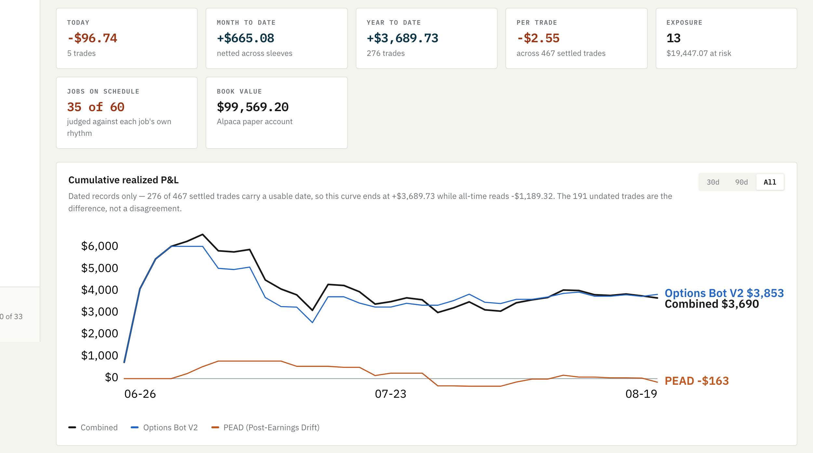
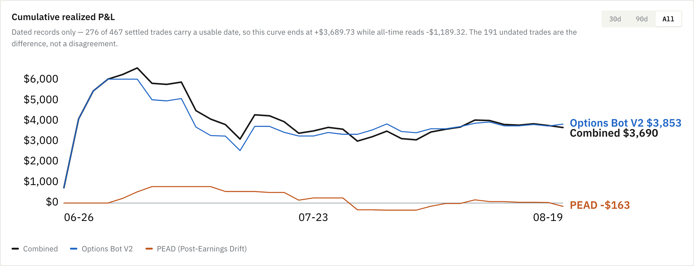
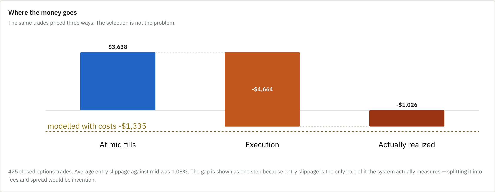
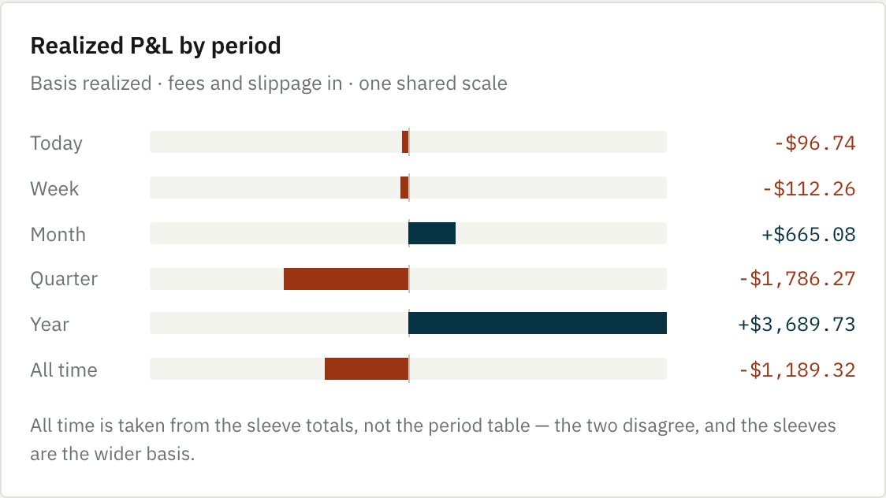
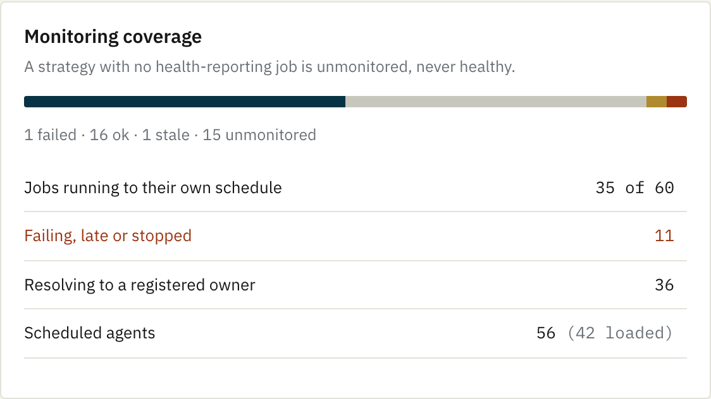
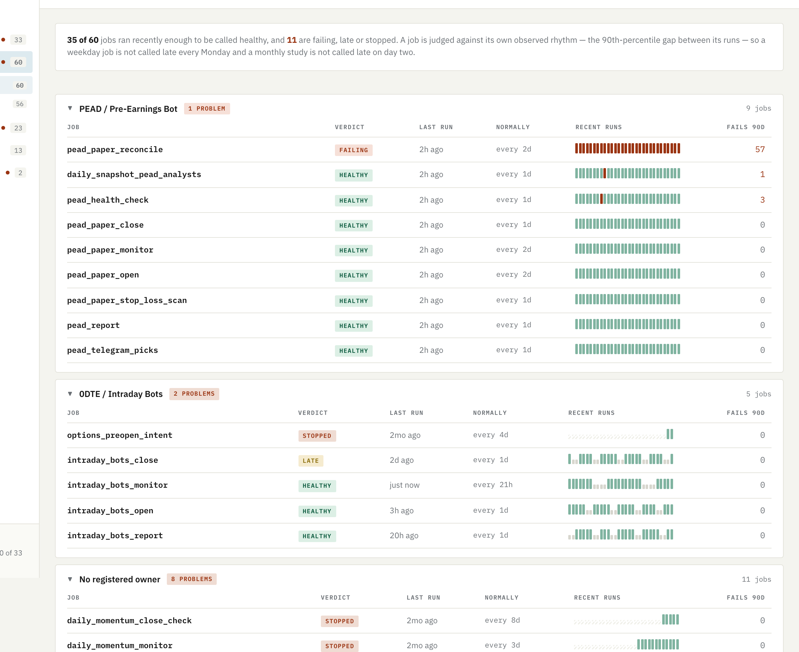
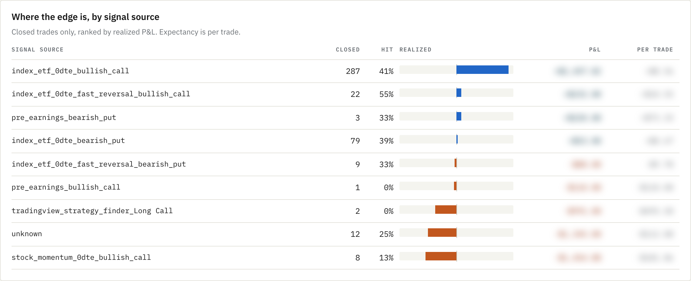
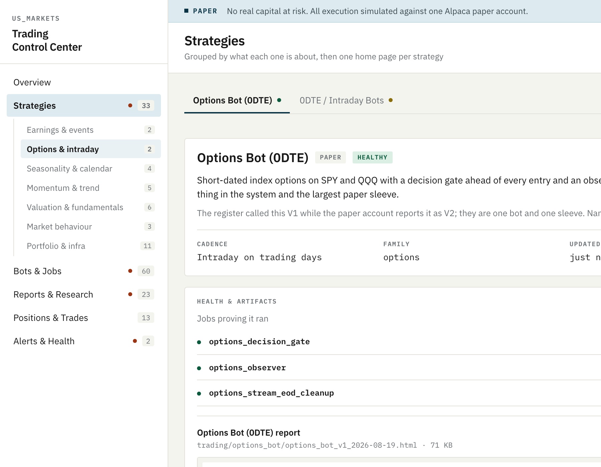
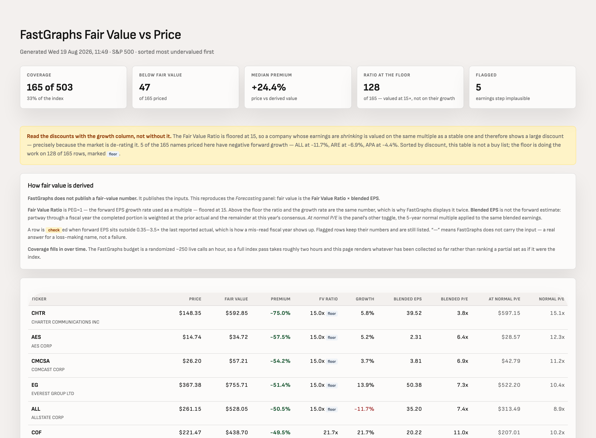

# Trading Control Center

An operations console I designed and built for a personal quantitative trading
system: **33 strategies, 60 scheduled jobs, 160 Python modules, 227 test files,
one shared brokerage account.**

This repository holds **screenshots and design notes only**. The implementation
is private.

---

## The product problem

Thirty-odd strategies had accumulated over two years — bots, signals, research
studies — each writing its own HTML report to disk. The failure mode wasn't a
missing feature. It was that **nobody could tell which of them were still
running**, and a report on disk that stopped updating looked identical to one
that was fine.

So the console answers four questions, in this order, and everything on the page
earns its place against one of them:

> **Am I making money · Is it working · Is it running · Is anything broken**

One screen, no scrolling required to reach the verdict. Money first, because
that is what the reader came for; operational health below it, because that is
what they need when the money looks wrong.

---

## Design decisions worth defending

**Silence is not health.** A strategy with no health-reporting job renders as
*unmonitored* — never green. The most dangerous state in an automated system is
a bot that stopped months ago and looks fine because nothing said otherwise.
Applying that rule surfaced **23 jobs wearing a green badge on a run months
old**, one silent for 76 days.

**A success expires.** Every job is scored against *its own observed rhythm* —
the 90th-percentile gap between its runs, not the median, because a weekday job
has a 72-hour weekend in its history and a badge that cries wolf every Monday is
a badge you stop reading.

**Exceptions first, literally.** Groups with nothing wrong open collapsed, so
the page is as long as the number of problems rather than the number of jobs.
This one change took a screen from 3,744px to 2,398px.

**"—" means the repo does not record it.** Nothing estimates, back-fills, or
rounds a missing number into an existing-looking one. Where two sources
disagree, the page says so rather than quietly picking a winner.

---

## Visualisation choices

Each form was chosen for the question it answers, not for variety. Colour is
assigned by the job it does — categorical for identity, diverging for polarity,
status for state — and every categorical palette was run through a
colourblind-separation check rather than eyeballed.

### Multi-series line — change over time
Direct end-labels as well as a legend, so series identity is never carried by
colour alone. One shared axis; never a dual axis.

### Waterfall — where a total went
The bridge from idealised to realised P&L. The descending float is labelled
*inside* itself: placed above, the label sits at the level the drop starts from
and reads as that level's value.

### Diverging bars — magnitude with polarity
One shared scale across all periods, so a $40 move and a $400 move cannot look
alike.

### Stacked proportion bar — parts of a whole
Coverage across health states, with the count spelled out beside it because a
proportion bar alone cannot be read to a number.

### Reliability strips — a track record, not a status
Borrowed from status-page convention. One cell per run, oldest left. This is
what separates a job that failed once from one that has failed 57 times in 58
runs — a distinction the previous design collapsed into the same sentence.

### Table with inline diverging bars — ranked attribution
Per-signal contribution, sorted. Values redacted; the structure is the point.

### Progressive disclosure — three-level navigation
Two levels vertical, third horizontal. 33 strategies across 7 families stay
navigable without a search box being the only way in.

### Card summary + dense table — a second surface
A valuation report reproducing a vendor's own model, with an interpretation
warning above the table because the ranking is misleading without it.

---

## Technology

| Layer | What I used |
|---|---|
| **Language** | Python 3.11 |
| **Data** | pandas, numpy, scipy |
| **Storage** | SQLite (WAL mode, async background writer, point-in-time snapshot tables) |
| **Frontend** | HTML/CSS/SVG. No framework, no build step, no JS dependencies — pages open straight from disk. (Web fonts are the one external request.) |
| **Charts** | SVG generated server-side; no charting library |
| **Automation** | launchd (62 agents), GitHub Actions |
| **Scraping** | Playwright (headless Chromium), lxml |
| **ML** | LightGBM, scikit-learn — day-type classifier, benchmarked against a rules baseline |
| **Security** | PBKDF2 + Fernet encrypted local credential vault; no secrets in source or logs |
| **Testing** | pytest — 227 test files, ~3,100 tests, run as a release gate |
| **Validation** | pydantic |

### API and data integrations

| Service | Used for | Integration |
|---|---|---|
| **Alpaca** | Paper brokerage — orders, fills, positions, account equity | REST |
| **Polygon** | Minute bars, options NBBO quotes | REST |
| **FastGraphs** | Fundamental valuation, normal P/E, analyst estimates | JWT-authenticated REST, rate-budgeted |
| **Financial Modeling Prep** | Fundamentals, earnings calendar, EOD OHLC | REST |
| **Tradier** | Options chains, sandbox order routing | REST |
| **yfinance** | Live quotes, 52-week ranges, market cap | Library |
| **SEC EDGAR** | Filings and structured company facts | REST |
| **Anthropic API** | LLM interpretation layer over earnings signals — async, 10 concurrent | REST |
| **Telegram Bot API** | Alert delivery | REST |
| **Seeking Alpha / StockAnalysis** | Ratings diffs, supplemental fundamentals | Playwright + parsing |
| **Wikipedia** | S&P 500 constituent anchor, pinned to a frozen revision | HTTP + parsing |
| **NASDAQ / Federal Reserve** | Listings, risk-free rate | REST |

Every vendor sits behind a single collector module, so a provider can be swapped
without touching anything downstream. Cross-source reconciliation is a **blocking
gate** before any signal research runs — treated as a release check, not a
warning.

---

## Engineering standards this is built to

**Point-in-time correctness.** Every stock-day is gated on whether the name was
actually in the index that day. That keeps the failures — SIVB's −60.4% and
FRC's −61.8%, both removed after collapsing — and excludes recycled tickers
whose later price series belong to a different company entirely.

**Manufactured events removed, and each correction listed on the page.**
Zero-volume rows, unadjusted splits confirmed against an independent source, and
distribution gaps — a $12 special dividend prints as −39.7% and is not a market
move.

**Honest measurement over flattering measurement.** The system tracks, per
trade, what the fill *would* have been at mid. That is how it can say the gap
between backtest and reality is execution rather than selection — a conclusion a
dashboard designed to look good would never surface.

---

*Screenshots show a paper trading account; no real capital is at risk. Some
values are redacted at render time — per-signal P&L attribution and validated
model parameters. Everything structural is intact.*
