# Automated Trading Research & Operations Platform

I designed and built an end-to-end product for developing, validating, and
operating systematic equity and options strategies. It brings market and
fundamental data, point-in-time research, backtesting, paper execution,
scheduling, monitoring, reporting, and evidence-grounded AI research into one
platform.

The **Trading Control Center** shown here is the platform's operating interface,
not the whole product.

| Platform scale | Current footprint |
|---|---:|
| Registered strategies and research studies | **40 across 7 families** |
| Automated operations | **72 health-reporting jobs · 65 scheduled agents** |
| Historical market data | **114.5M options minute bars · 6.6M daily-price rows** |
| Codebase | **269K tracked Python lines · 194K implementation/research + 75K tests** |
| Verification | **4,200+ tests across 250 test files** |
| External systems | **12+ market-data, brokerage, filing, research, and alert integrations** |

This repository holds **screenshots and design notes only**. The implementation
is private.

---

## The product problem

The original goal was to turn trading hypotheses into repeatable automated
strategies. Over time that expanded into momentum, mean-reversion, seasonality,
valuation, earnings, and short-dated options systems, each using different data
sources, horizons, schedules, and evaluation rules.

The hard product problem became the entire lifecycle:

> **Can I move from an idea to a point-in-time backtest, promote only credible
> strategies to paper trading, operate them safely, and learn from actual
> outcomes?**

Building more strategies without shared infrastructure created predictable
failure modes: duplicated data acquisition, inconsistent assumptions,
survivorship-biased research, reports with no common navigation, and bots whose
last successful run never expired. The platform was built to make each stage
explicit and auditable.

## Platform lifecycle

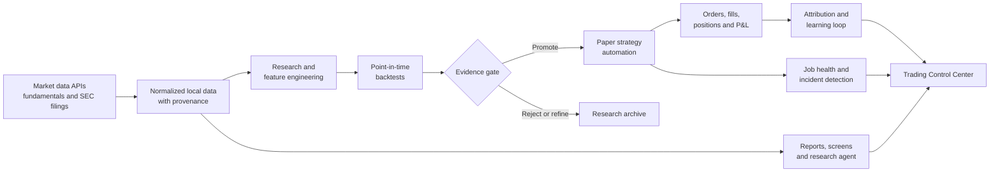

| Platform capability | Product responsibility |
|---|---|
| **Data foundation** | Ingest and reconcile prices, fundamentals, filings, estimates, options quotes, constituents, and corporate actions from multiple vendors. |
| **Strategy laboratory** | Run survivorship-aware, point-in-time backtests; compare variants against SPY; archive assumptions and results before promotion. |
| **Automation layer** | Schedule scans and bots across intraday, daily, monthly, and quarterly cadences; isolate paper execution from the disabled live path. |
| **Decision support** | Turn the S&P 500 into searchable valuation, quality, momentum, seasonality, volatility, and recovery research surfaces. |
| **Operations layer** | Track ownership, freshness, failures, fills, positions, P&L, and strategy-specific evidence across the automated estate. |
| **Learning loop** | Compare simulated assumptions with actual paper fills and attribute outcomes back to strategy, signal source, and execution quality. |

### Strategy portfolio

| Family | Examples in the platform |
|---|---|
| **Options and intraday** | 0DTE pullback systems, regime classification, IV snapshots, options-chain validation, paper order routing, and reconciliation. |
| **Earnings and catalysts** | Pre-earnings opportunity scoring, post-earnings drift, earnings-movement scoring, filing ingestion, and estimate-revision research. |
| **Momentum and mean reversion** | Directional momentum, quarterly momentum, monthly streaks, oversold snap, and combined technical/fundamental/momentum screens. |
| **Seasonality** | Monthly stock and options selection, rolling win-rate studies, tenure-constrained universes, and SPY-relative evaluation. |
| **Fundamental and valuation** | Multi-method fair value, sector-relative P/E, P/S and PEG maps, undervaluation screens, quality pillars, and earnings forecasts. |
| **Market behaviour** | Volatility distributions, annual ranges, drawdown/recovery, quarterly winners, and index-relative performance studies. |
| **Platform operations** | Strategy registry, simulated accounts, evidence ledger, scorecards, performance attribution, reporting, and job health. |

## The Control Center — one interface for the platform

At 40 strategies, separate report files stopped scaling as a product. The
Control Center became the common navigation and operating layer. It answers
four questions, in order:

> **Am I making money · Is it working · Is it running · Is anything broken**

One screen reaches the verdict without requiring the operator to inspect every
bot. Money comes first; strategy evidence and operational health explain what
happened and whether the result can be trusted.

---

## Product surfaces

The console is the navigation and operating layer; the underlying strategy and
research reports keep their own analytical depth. Embedded reports can be
resized in place or opened standalone.

### Strategy lifecycle and operations

<table>
  <tr>
    <td width="50%">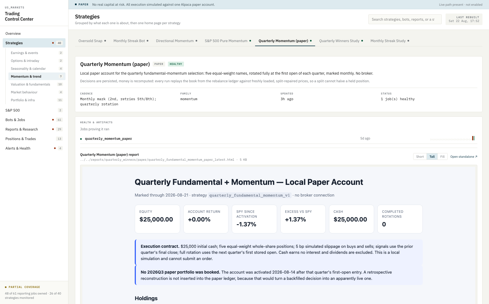</td>
    <td width="50%">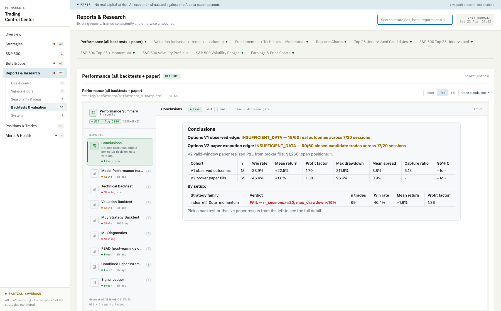</td>
  </tr>
  <tr>
    <td><b>One home per strategy.</b> Objective, lifecycle stage, cadence, job evidence, operating status, and the latest paper result share one workspace.</td>
    <td><b>Research before promotion.</b> Backtests, variant comparisons, diagnostics, and decision gates stay as immutable research artifacts but gain one consistent discovery layer.</td>
  </tr>
</table>

The registry distinguishes research studies, paper strategies, production
systems, and dormant work. A promising backtest does not silently become a bot;
promotion is an explicit product decision with evidence attached.

### Case study — evidence-grounded research agent

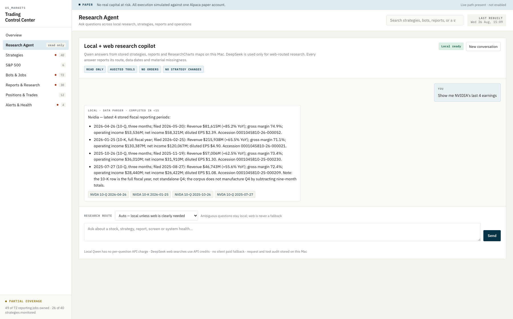

**Problem.** A generic chatbot could describe a company, but it could not be
trusted to know which local report was current, distinguish a quarter from a
full fiscal year, or admit when evidence was missing.

**Product decision.** I built a read-only research agent over registered project
tools and a local SEC filing corpus. In the example above, “Show me NVIDIA's
last 4 earnings” is answered by a deterministic financial-data path—not model
memory—with filing dates, period scope, accession links, missingness, and
completion time. Local Qwen handles interpretation; DeepSeek is reserved for an
explicitly selected web-research route, so a vague question cannot silently
spend API credits.

**Guardrail.** The agent can inspect and explain, but it cannot place orders or
change a strategy. A response that does not inspect evidence is discarded
instead of being presented as financial research.

### Case study — observability for 72 automated jobs

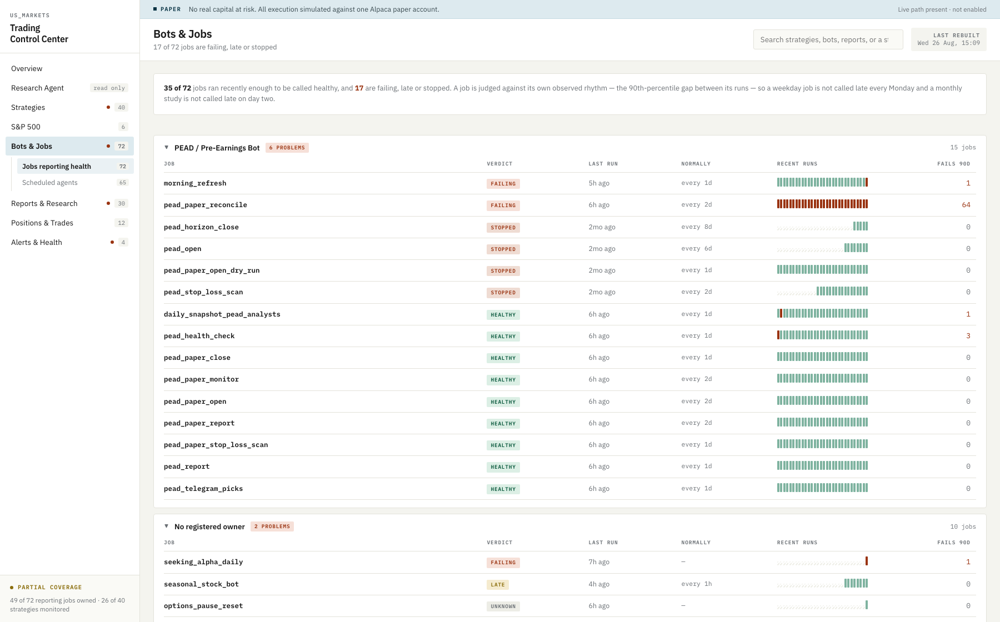

**Problem.** A successful run record never expired, so a bot that stopped
months ago could still look healthy. A single global freshness threshold also
misclassified weekend, intraday, daily, and monthly jobs.

**Product decision.** I replaced the binary badge with cadence-aware health.
Each job now exposes its verdict, last run, normal observed rhythm, 90-day
failure count, owner, and run-by-run reliability strip. Exceptions open first;
healthy groups collapse. This distinguishes one transient failure from a job
that failed 57 of its last 58 runs and makes the next operator action visible.

**Outcome.** The first audit found 23 false-green jobs, including one that had
been silent for 76 days. Unowned and unmonitored systems are now explicit
states—not implied successes.

### S&P 500 cross-sectional research

<table>
  <tr>
    <td width="50%">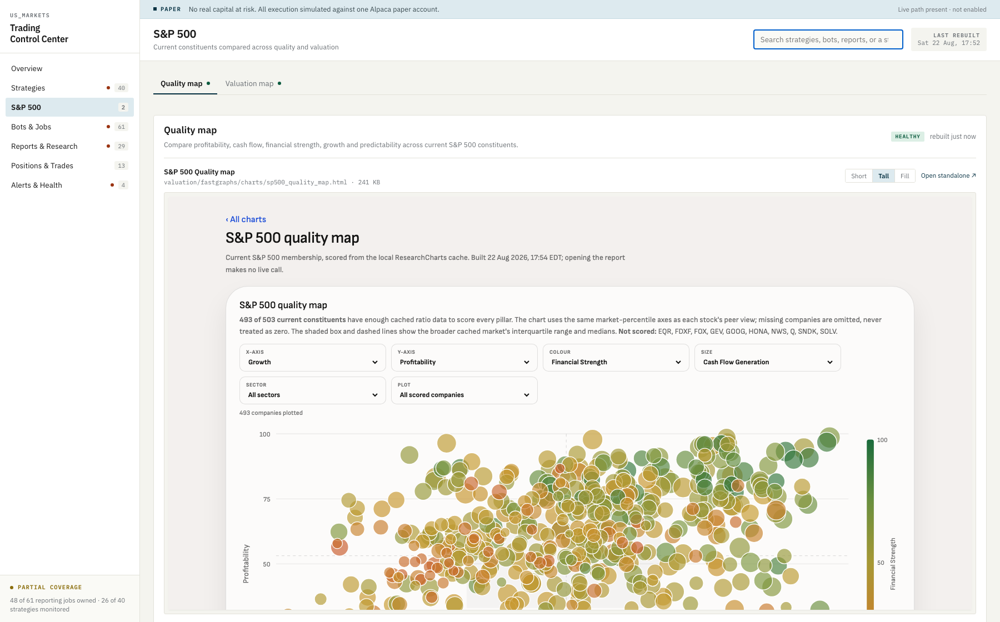</td>
    <td width="50%">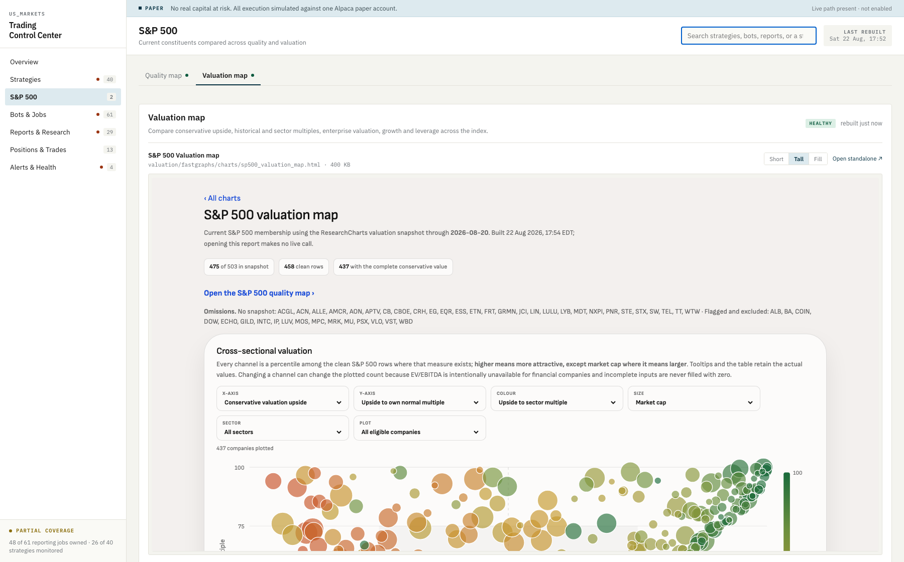</td>
  </tr>
  <tr>
    <td><b>Quality map.</b> Compare profitability, cash-flow generation, financial strength, growth, and predictability across current constituents.</td>
    <td><b>Valuation map.</b> Compare conservative upside, historical and sector multiples, enterprise valuation, growth, leverage, and market cap.</td>
  </tr>
</table>

Both maps expose selectable axes, colour, bubble size, sector, and plot scope.
Missing inputs are omitted and disclosed instead of being converted to zero.

<table>
  <tr>
    <td width="50%">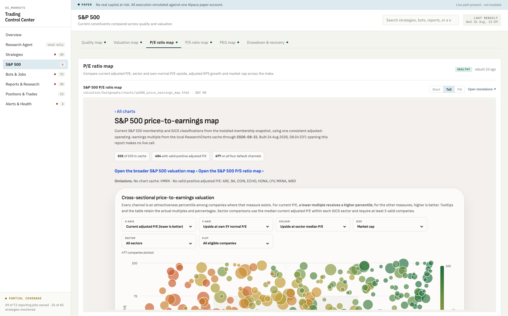</td>
    <td width="50%">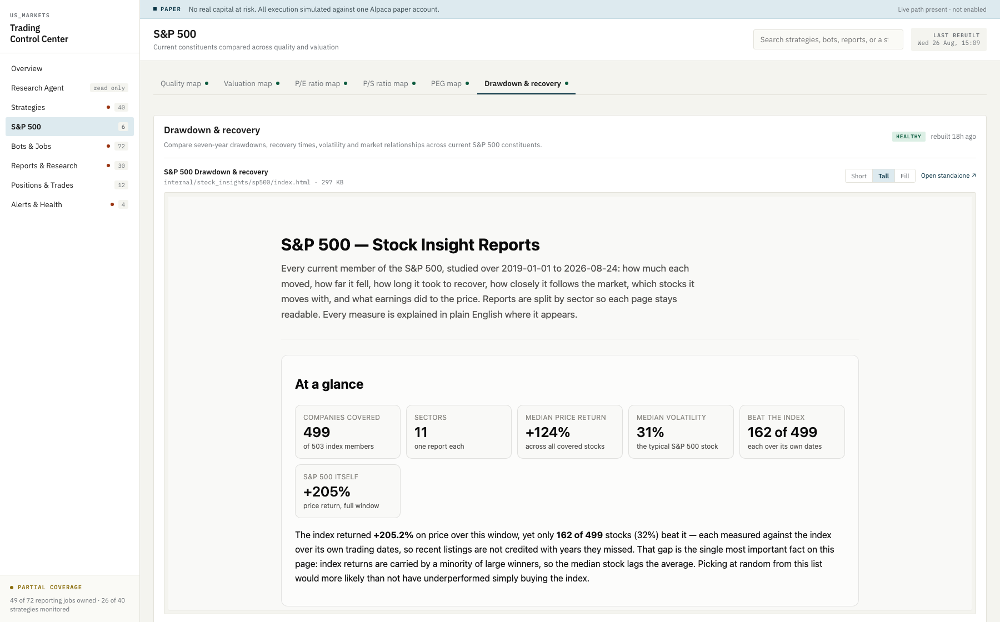</td>
  </tr>
  <tr>
    <td><b>Ratio-specific valuation.</b> Separate P/E, P/S, and PEG maps prevent one composite score from hiding why a stock looks cheap. Actual measures remain in tooltips and tables; the plot uses cross-sectional percentiles so unlike channels can share one visual grammar.</td>
    <td><b>Drawdown and recovery.</b> Seven years of daily history become a searchable research surface for downside, time to recover, volatility, and benchmark-relative returns. Each stock is compared with the index over its own eligible dates.</td>
  </tr>
</table>

### Retrieval and operational freshness

<table>
  <tr>
    <td width="50%">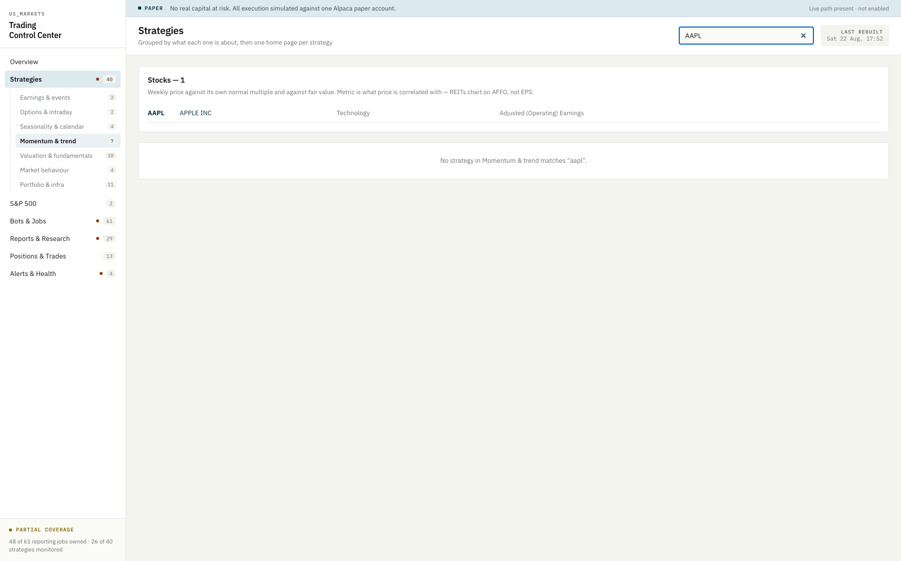</td>
    <td width="50%">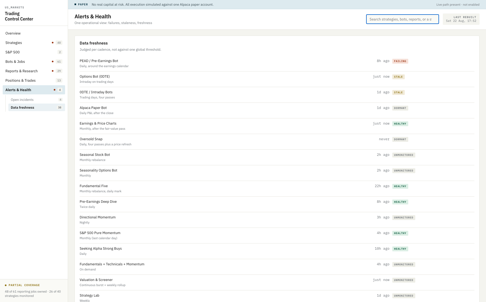</td>
  </tr>
  <tr>
    <td><b>One search surface.</b> The same control finds strategies, bots, reports, tickers, and company names.</td>
    <td><b>Cadence-aware freshness.</b> Daily, intraday, monthly, and on-demand systems are judged against their own expected rhythm.</td>
  </tr>
</table>

---

## Product decisions that shaped the platform

**A strategy is a lifecycle, not a script.** Research, paper trading,
production, and dormant work are distinct states in the registry. Promotion
requires an explicit evidence decision; a strong historical result cannot
quietly acquire execution authority.

**Data quality is a release gate.** Cross-source reconciliation, point-in-time
membership, filing provenance, and missing-data coverage are checked before
signal research. A pipeline with incomplete inputs reports degraded or fails;
it does not publish a normal-looking ranking from a partial universe.

**Silence is not health.** A strategy with no health-reporting job renders as
*unmonitored* — never green. The most dangerous state in an automated system is
a bot that stopped months ago and looks fine because nothing said otherwise.
Applying that rule surfaced **23 jobs wearing a green badge on a run months
old**, one silent for 76 days.

**A success expires.** Every job is scored against *its own observed rhythm* —
the 90th-percentile gap between its runs, not the median, because a weekday job
has a 72-hour weekend in its history and a badge that cries wolf every Monday is
a badge you stop reading.

**Exceptions first, literally.** Groups with nothing wrong open collapsed, so
the page is as long as the number of problems rather than the number of jobs.
This one change took a screen from 3,744px to 2,398px.

**"—" means the repo does not record it.** Nothing estimates, back-fills, or
rounds a missing number into an existing-looking one. Where two sources
disagree, the page says so rather than quietly picking a winner.

---

## Visualisation choices

Each form was chosen for the question it answers, not for variety. Colour is
assigned by the job it does — categorical for identity, diverging for polarity,
status for state — and every categorical palette was run through a
colourblind-separation check rather than eyeballed.

### Multi-series line — change over time
Direct end-labels as well as a legend, so series identity is never carried by
colour alone. One shared axis; never a dual axis.

### Waterfall — where a total went
The bridge from idealised to realised P&L. The descending float is labelled
*inside* itself: placed above, the label sits at the level the drop starts from
and reads as that level's value.

### Diverging bars — magnitude with polarity
One shared scale across all periods, so a $40 move and a $400 move cannot look
alike.

### Stacked proportion bar — parts of a whole
Coverage across health states, with the count spelled out beside it because a
proportion bar alone cannot be read to a number.

### Reliability strips — a track record, not a status
Borrowed from status-page convention. One cell per run, oldest left. This is
what separates a job that failed once from one that has failed 57 times in 58
runs — a distinction the previous design collapsed into the same sentence.

### Table with inline diverging bars — ranked attribution
Per-signal contribution, sorted. Values redacted; the structure is the point.

### Progressive disclosure — three-level navigation
Two levels vertical, third horizontal. 40 strategies across 7 families stay
navigable without a search box being the only way in.

### Card summary + dense table — a second surface
A valuation report reproducing a vendor's own model, with an interpretation
warning above the table because the ranking is misleading without it.

---

## Platform architecture and technology

| Layer | What I used |
|---|---|
| **Language** | Python 3.11 |
| **Data** | pandas, numpy, scipy |
| **Storage** | SQLite (WAL mode, async background writer, point-in-time snapshot tables) |
| **Frontend** | HTML/CSS/SVG. No framework, no build step, no JS dependencies — pages open straight from disk. (Web fonts are the one external request.) |
| **Charts** | SVG generated server-side; no charting library |
| **Automation** | launchd (65 agents), GitHub Actions |
| **Scraping** | Playwright (headless Chromium), lxml |
| **ML** | LightGBM, scikit-learn — day-type classifier, benchmarked against a rules baseline |
| **Security** | PBKDF2 + Fernet encrypted local credential vault; no secrets in source or logs |
| **Testing** | pytest — 75K lines across 250 test files; 4,200+ tests run as a release gate |
| **Validation** | pydantic |

### API and data integrations

| Service | Used for | Integration |
|---|---|---|
| **Alpaca** | Paper brokerage — orders, fills, positions, account equity | REST |
| **Polygon** | Minute bars, options NBBO quotes | REST |
| **ResearchCharts** | Fundamental valuation, normal P/E, analyst estimates | JWT-authenticated REST, rate-budgeted |
| **Financial Modeling Prep** | Fundamentals, earnings calendar, EOD OHLC | REST |
| **Tradier** | Options chains, sandbox order routing | REST |
| **yfinance** | Live quotes, 52-week ranges, market cap | Library |
| **SEC EDGAR** | Filings and structured company facts | REST |
| **Ollama / Qwen** | Private, no-per-query-cost interpretation over registered local research tools | Loopback service |
| **DeepSeek** | Explicitly routed web research and long-form valuation analysis | REST |
| **Anthropic API** | LLM interpretation layer over earnings signals — async, 10 concurrent | REST |
| **Telegram Bot API** | Alert delivery | REST |
| **Seeking Alpha / StockAnalysis** | Ratings diffs, supplemental fundamentals | Playwright + parsing |
| **Wikipedia** | S&P 500 constituent anchor, pinned to a frozen revision | HTTP + parsing |
| **NASDAQ / Federal Reserve** | Listings, risk-free rate | REST |

Vendor-specific acquisition is isolated at collector and store boundaries;
downstream strategy code consumes normalized models rather than provider
payloads. Cross-source reconciliation is a **blocking gate** before signal
research runs—treated as a release check, not a warning.

---

## Engineering standards this is built to

**Point-in-time correctness.** Every stock-day is gated on whether the name was
actually in the index that day. That keeps the failures — SIVB's −60.4% and
FRC's −61.8%, both removed after collapsing — and excludes recycled tickers
whose later price series belong to a different company entirely.

**Manufactured events removed, and each correction listed on the page.**
Zero-volume rows, unadjusted splits confirmed against an independent source, and
distribution gaps — a $12 special dividend prints as −39.7% and is not a market
move.

**Honest measurement over flattering measurement.** The system tracks, per
trade, what the fill *would* have been at mid. That is how it can say the gap
between backtest and reality is execution rather than selection — a conclusion a
dashboard designed to look good would never surface.

---

*Screenshots show a paper trading account; no real capital is at risk. Some
values are redacted at render time — per-signal P&L attribution and validated
model parameters. Everything structural is intact.*
