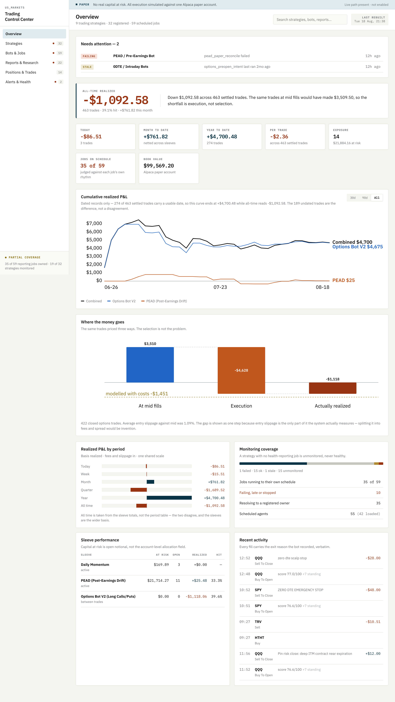
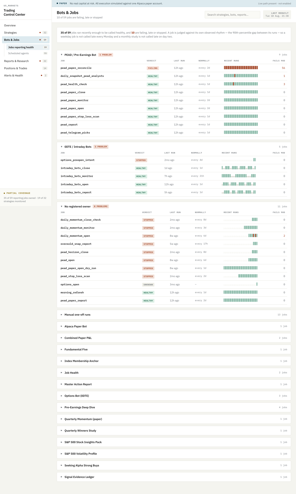
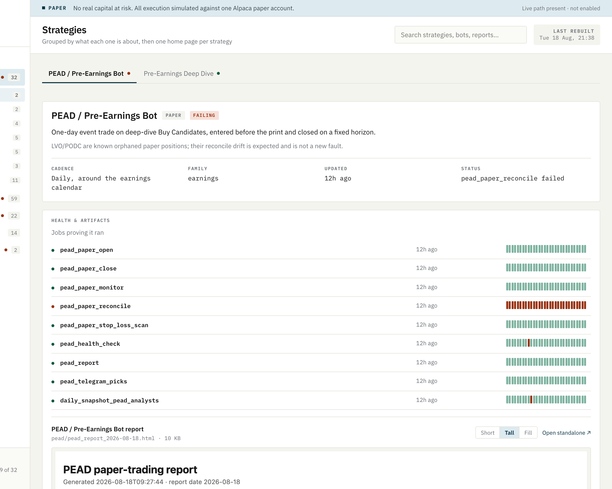
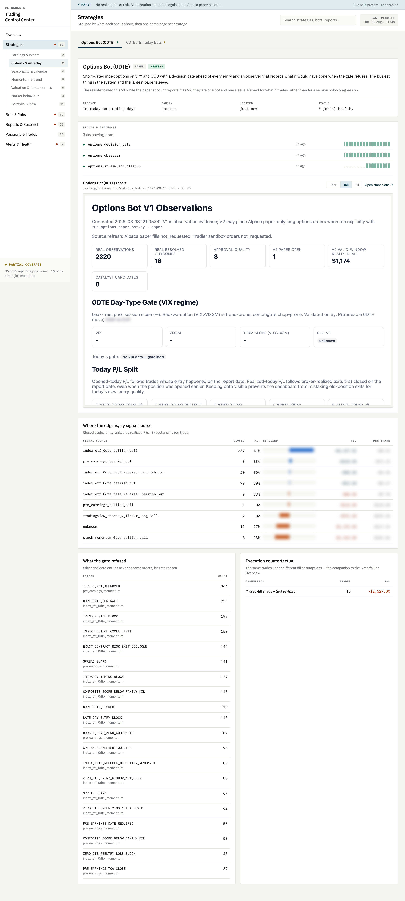

# Trading Control Center

An operations console for a personal quantitative trading system: 32 registered
strategies, 59 scheduled jobs, one shared paper brokerage account.

This repository holds **screenshots only**. The implementation is private.

---

## What it does

One page answers four questions: *am I making money, is it working, is it
running, is anything broken.* Everything is derived from a declarative strategy
register and the system's own job ledger — nothing is inferred from filenames,
and nothing is hand-maintained twice.

The page is static HTML, built by a scheduled job and opened from disk. There is
no server.

---

## The design principle: silence is not health

The most dangerous state in an automated trading system is a bot that stopped
months ago and looks fine because nothing said otherwise. Three rules follow
from that, and they drove most of the engineering:

**A strategy with no health-reporting job renders as _unmonitored_, never green.**
Absence of evidence is not evidence of health.

**A successful run expires.** Every job is scored against *its own observed
rhythm* — the 90th-percentile gap between its runs, not the median, because a
weekday job's gaps are mostly 24h with a 72h weekend mixed in, and a badge that
cries wolf every Monday is a badge you stop reading. Where a job has run too few
times to have a rhythm, its owning strategy's declared cadence stands in. Where
neither exists the verdict is `unknown`, never green.

**Staleness is judged per cadence.** A quarterly study three weeks old is fine.
A daily signal three weeks old is dead. One global threshold would make both
wrong.

Each job carries its last 30 outcomes as a strip, which is what separates a job
that failed once from one that has failed 56 times in 57 runs. Groups with
nothing wrong open collapsed, so the page is as long as the number of problems
rather than the number of jobs.

Applying these rules found **23 jobs wearing a green badge on a run months old**
— one silent for 76 days.

---

## Honest measurement

Every strategy's own report is embedded inline rather than linked away, with the
fit decided at build time. (It cannot be decided in the browser: opened over
`file://` a framed report is a foreign origin and its height is unreadable.)

Two conventions run through the whole system:

- **"—" means the repo does not record it.** Nothing estimates, back-fills, or
  rounds a missing number into an existing-looking one.
- **Where two sources disagree, the page says so rather than picking quietly.**
  All-time P&L is taken from the sleeve totals, not the period table; the two
  differ by the trades that carry no usable date, and the difference is stated
  on the page instead of being reconciled away.

---

## What the measurement found

The system is a net loser on paper, and the console is built to say why rather
than to flatter it.

The same trades priced at mid fills would have made money; priced at actual
fills they lose. **The shortfall is execution, not selection** — a conclusion the
page reaches by tracking, per trade, what the fill would have been. Cut by signal
source, one source carries the entire edge and two small ones destroy most of it.

That is the finding I would most want a reviewer to look at. A backtest that
reports a profit and an execution model that reports a loss are the same
strategy, and only one of them is real.

> **A note on the blurred values.** Per-signal P&L attribution and the gate's
> validated regime probabilities are the parts of this that took the longest to
> earn, so they are redacted at render time. Everything structural is intact:
> the decision gate and its refusal taxonomy, the per-source measurement, the
> counterfactual. Happy to walk through the numbers in an interview.

---

## Correctness standards

The research underneath this console holds to two rules that most hobby
backtests do not:

**Point-in-time universe membership.** Every stock-day is gated on whether the
name was actually in the index that day. This keeps the failures — SIVB's −60.4%
and FRC's −61.8%, both removed from the index after collapsing — and
simultaneously excludes recycled tickers whose later price series belong to a
different security entirely.

**Manufactured tail events are removed, and each correction is listed on the
page.** Zero-volume rows, unadjusted splits confirmed against an independent
source, and distribution gaps — a $12 special dividend prints as −39.7% and is
not a market move.

Data-quality gates are treated as blocking, not advisory.

---

## Scale

| | |
|---|---|
| Registered strategies | 32 |
| Scheduled jobs reporting health | 59 |
| launchd agents | 55 |
| Automated tests | 3,124 |
| Storage | SQLite (WAL), point-in-time membership snapshots |
| Delivery | static HTML consoles, Telegram alerts |

Python, SQLite, Playwright, launchd. 

*Screenshots show a paper trading account. No real capital is at risk.*
